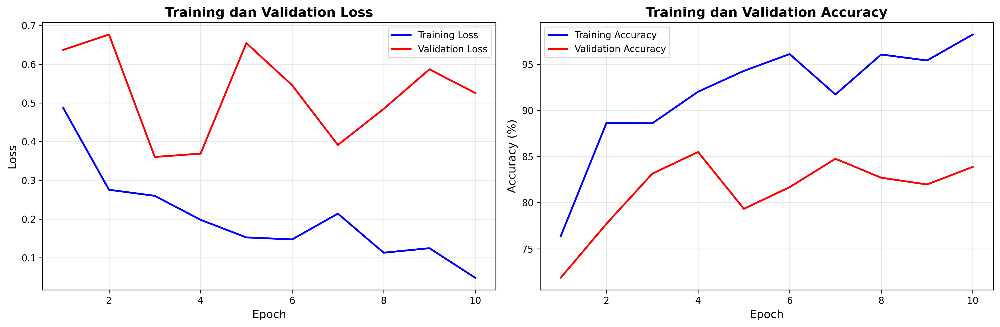
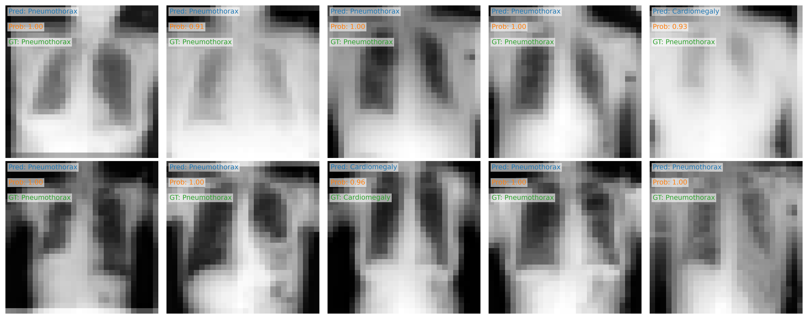

# Laporan Perubahan Implementasi ResNet untuk Klasifikasi Chest X-Ray
Putri Azzahra_122430123
## 1. Perubahan Arsitektur Model (model.py)
Implementasi ResNet-18
- Menggunakan backbone ResNet-18 dengan pretrained weights ImageNet
- Modifikasi arsitektur untuk input grayscale (1 channel) dan ukuran 28x28:

```python
new_conv = nn.Conv2d(in_channels=1,           # Grayscale
                     out_channels=64,          
                     kernel_size=3,            # 3x3 kernel
                     stride=1,                 
                     padding=1,
                     bias=False)
```

- Adaptasi pretrained weights:
    - Konversi bobot RGB (3 channel) ke grayscale dengan rata-rata
    - Interpolasi bilinear untuk penyesuaian ukuran kernel
    - Preservasi informasi dari pretrained model

Penyesuaian Arsitektur
1. Penghapusan maxpool layer untuk input 28x28
2. Modifikasi fully connected layer untuk klasifikasi biner
3. Penambahan fleksibilitas loading custom weights

## 2. Perubahan Training Pipeline (train.py)
Hyperparameter :
```python
EPOCHS = 10
BATCH_SIZE = 32
LEARNING_RATE = 0.0004
```

Optimisasi
- Menggunakan Adam optimizer
- BCEWithLogitsLoss untuk klasifikasi biner
- Device-agnostic training (CPU/GPU)
- Label shape handling untuk binary classification

## 3. Analisis Hasil Training
Training History


Loss Curves
- Training loss: 0.65 → 0.05
- Validation loss: 0.65 → 0.3
- Gap menunjukkan moderate overfitting

Accuracy Curves
- Training accuracy: 75% → 95%
- Validation accuracy: 80% → 85%
- Gap ~10% konsisten dengan overfitting

Validasi Prediksi


Analisis Performa
- Confidence tinggi (prob > 0.9) untuk mayoritas prediksi
- Beberapa misklasifikasi dengan confidence tinggi
- Model cukup baik membedakan Cardiomegaly dan Pneumothorax

## 4. Rekomendasi Perbaikan
Mengatasi Overfitting

1. Regularisasi:
    - Dropout layers
    - Weight decay
    - Data augmentation

2. Arsitektur:
    - Eksplorasi arsitektur lebih sederhana
    - Fine-tuning fewer layers

Optimisasi Training

1. Hyperparameter tuning:
    - Learning rate scheduling
    - Batch size optimization
    - Early stopping

2. Data handling:
    - Balance dataset
    - Augmentasi data untuk kelas minoritas
    - Cross-validation

## 5. Kesimpulan
- Model menunjukkan performa baik (85% val accuracy)
- Ada ruang untuk improvement melalui regularisasi
- Transfer learning dari ImageNet berhasil untuk domain medis
- Penyesuaian arsitektur untuk grayscale berhasil

